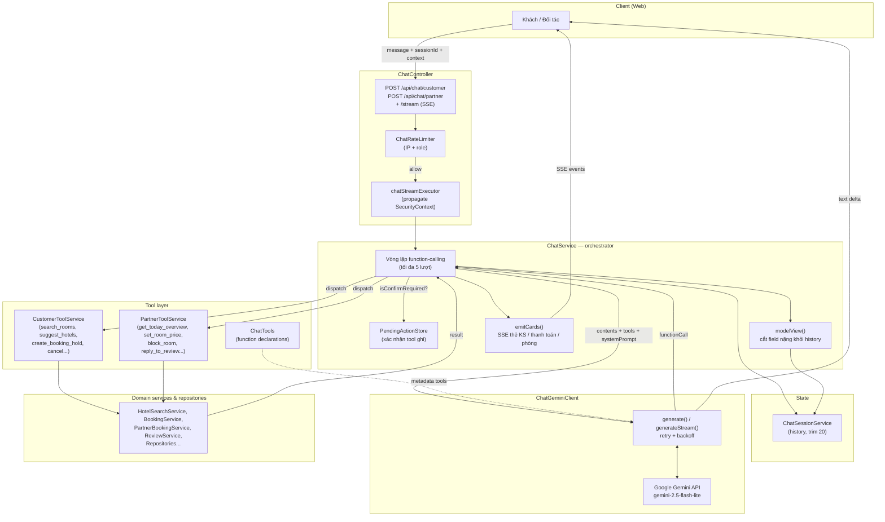
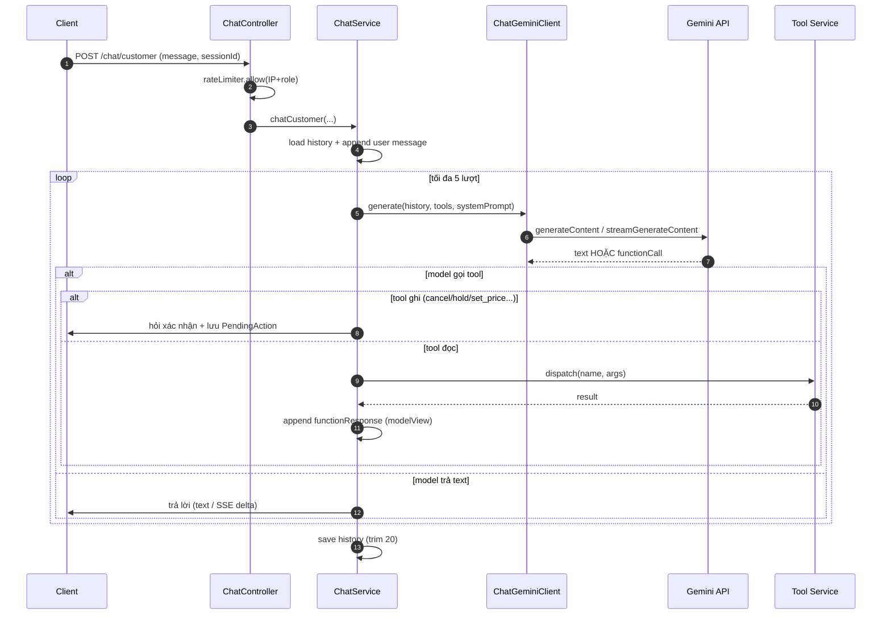
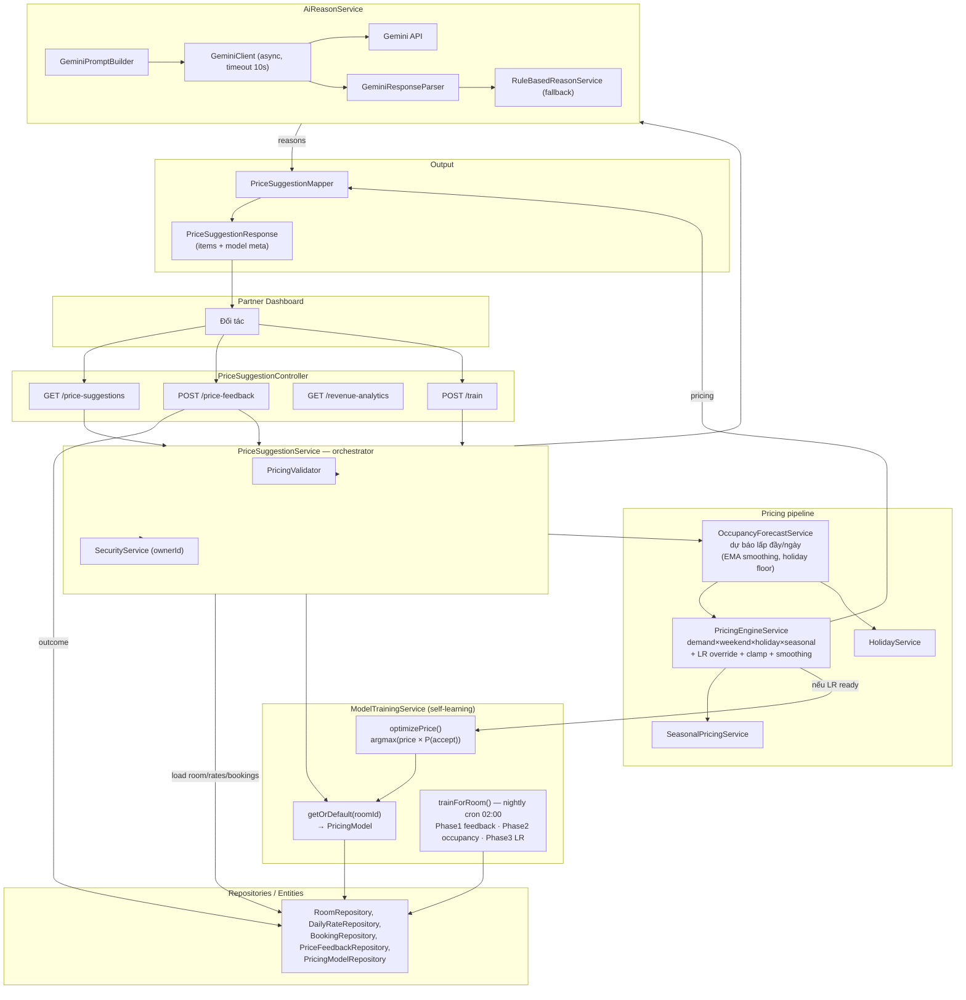
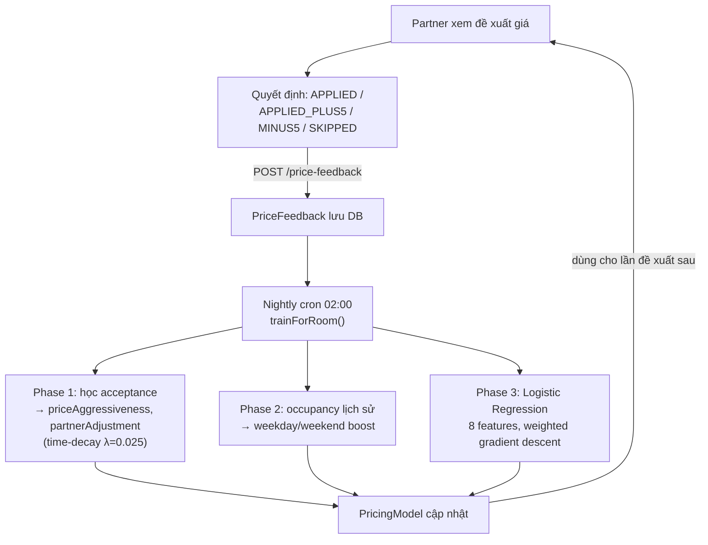

# Sơ đồ cấu trúc 2 model AI của HotelHub

Tài liệu mô tả kiến trúc 2 tính năng AI trong backend:

1. **Chatbot** (trợ lý đặt phòng / quản lý) — dùng Gemini **function-calling**.
2. **Gợi ý giá** (AI Pricing) — engine luật + **Logistic Regression** tự học, kèm Gemini sinh lý do.

---

## 1. Chatbot (Gemini Function-Calling)

### 1.1. Sơ đồ thành phần



### 1.2. Luồng xử lý 1 request (sequence)



**Điểm chính:**
- Tool **ghi** (`cancel_my_booking`, `create_booking_hold`, `block_room`, `set_room_price`, `reply_to_review`) không chạy ngay — lưu `PendingActionStore` + gửi nút xác nhận, chỉ chạy khi client gửi lại `confirm=true`.
- `modelView()` cắt `coverImage` / `payUrl` / `days` khỏi tool result trước khi đưa vào history → tiết kiệm token (history gửi lại Gemini mỗi lượt).
- Khi Gemini chưa cấu hình key hoặc lỗi/timeout → trả câu fallback thay vì 500.
- Partner cần JWT → controller propagate `SecurityContext` sang worker thread của SSE.

---

## 2. Gợi ý giá (AI Pricing)

### 2.1. Sơ đồ thành phần



### 2.2. Pipeline tính giá cho 1 phòng

```mermaid
flowchart LR
    A["Input: roomId, from, to"] --> B["Load: Room, DailyRate,<br/>Bookings 90 ngày"]
    B --> C["PricingModel<br/>(getOrDefault)"]
    C --> D["OccupancyForecast<br/>dự báo occupancy/ngày"]
    D --> E["PricingEngine: tính giá"]
    E --> E1["demand × weekend ×<br/>holiday × seasonal"]
    E1 --> E2{"LR đã train?"}
    E2 -->|có| E3["optimizePrice()<br/>argmax(price×P)"]
    E2 -->|chưa| E4["giá rule-based"]
    E3 --> F["Soft clamp<br/>(±15/25/35%)"]
    E4 --> F
    F --> G["Day-over-day smoothing<br/>(±20%/ngày)"]
    G --> H["AiReasonService<br/>sinh lý do (Gemini→fallback)"]
    H --> I["PriceSuggestionResponse"]
```



### 2.3. Vòng học của model (training loop)



**Đặc trưng (features) của Logistic Regression (8 chiều):**

| # | Feature | Ý nghĩa |
|---|---------|---------|
| 0 | bias | hằng số |
| 1 | priceUplift | (giá đề xuất / giá gốc) − 1 |
| 2 | isWeekend | cuối tuần? |
| 3 | isHoliday | ngày lễ? |
| 4 | sin(dow) | chu kỳ thứ trong tuần |
| 5 | cos(dow) | chu kỳ thứ trong tuần |
| 6 | leadTimeNorm | thời gian đặt trước (0=sát ngày, 1=60 ngày) |
| 7 | seasonalDeviation | hệ số mùa vụ − 1.0 |

**Điểm chính:**
- `optimizePrice()` quét giá từ 75%→150% giá gốc, chọn giá tối đa hoá **kỳ vọng doanh thu = giá × P(chấp nhận)**.
- Feedback được **time-decay** (mới hơn = trọng số cao hơn, half-life ≈ 28 ngày).
- Cần tối thiểu **5 feedback** trong cửa sổ 60 ngày mới train (nếu không → `hasSufficientData=false`, dùng rule-based).
- AI sinh lý do (Gemini) có **timeout 10s + cache + fallback rule-based** → không bao giờ chặn luồng tính giá.

---

## So sánh nhanh 2 model

| | Chatbot | Gợi ý giá |
|---|---------|-----------|
| Vai trò AI | Gemini quyết định gọi tool nào (function-calling) | LR tự học + engine luật; Gemini chỉ sinh lý do |
| Tự học | Không (stateless theo session) | Có (nightly training từ feedback) |
| Fallback khi Gemini lỗi | Câu xin lỗi cố định | Lý do rule-based, giá vẫn tính bình thường |
| Đầu vào chính | history hội thoại + context | bookings, dailyRate, feedback, holiday/season |
| Output | text (stream) + thẻ UI | danh sách giá đề xuất theo ngày + lý do |
```
